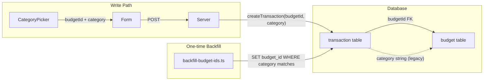

# Category Combobox Rework

## Current State

The category field in [`create-transaction-form.svelte`](src/lib/components/transaction/create-transaction-form.svelte) (lines 388-401) is a plain `<Input>` with a native `<datalist>`. Linking between transactions and budgets is purely by **string equality** on `transaction.category` vs `budget.category` -- no FK, no guarantees.

## Part 1: Backend -- Add `budgetId` FK (non-destructive)

### 1A. Schema change

Add a **nullable** `budgetId` column to the `transaction` table in [`schema.ts`](src/lib/infra/db/schema.ts):

```typescript
budgetId: text('budget_id').references(() => budget.id, { onDelete: 'set null' }),
```

Key choices:

- **Nullable** -- existing rows get `NULL`, no breakage.
- **`onDelete: 'set null'`** -- if a budget is deleted, transactions stay intact, they just lose the link.
- The `category` text column is **kept as-is** -- it remains the human-readable label. `budgetId` is the canonical link.

Generate the migration with `npx drizzle-kit generate`. This produces a new SQL file in `drizzle/` (e.g. `0003_xxx.sql`) containing:

```sql
ALTER TABLE "transaction" ADD COLUMN "budget_id" text REFERENCES "budget"("id") ON DELETE SET NULL;
```

### 1B. Backfill existing data

Create a one-time script (e.g. `src/lib/infra/db/backfill-budget-ids.ts`) that:

1. Fetches all budgets grouped by `(userId, category)`.
2. For each transaction that has a `category` and `budgetId IS NULL`:
   - Joins through `account` to get the `userId`.
   - Looks up a budget where `budget.category = transaction.category` AND `budget.userId = account.userId`.
   - If a match exists, sets `transaction.budgetId = budget.id`.
3. If multiple budgets match (same category, different currency/period), pick the one whose `currencyId` matches the transaction's account currency.

This is a safe, additive operation -- it only sets `NULL` fields, never overwrites existing data.

Run it via a small script entry point (e.g. `npx tsx src/lib/infra/db/backfill-budget-ids.ts`).

### 1C. Update event payloads and create logic

In [`events.ts`](src/lib/domain/events.ts), add `budgetId: string | null` to:

- `TransactionCreatedPayload` (line 89)
- `TransactionUpdatedPayload.changes` (line 112)
- `TransactionUpdatedPayload.previousValues` (line 123)
- `TransferCreatedPayload` (same pattern)

In [`create-transaction.ts`](src/lib/application/transaction/create-transaction.ts):

- Accept `budgetId?: string` in the input DTO.
- Pass it into the event payload and projection write.
- The budget projection update logic (`getActiveBudgetsByCategory`) can stay string-based for now -- `budgetId` is the link for reading, category-string is still used for budget spend aggregation (which operates across all matching budgets anyway).

In [`edit-transaction.ts`](src/lib/application/transaction/edit-transaction.ts):

- Accept `budgetId?: string | null` in `UpdateTransactionDTO`.
- Include it in the change detection, event payload, and projection update.

In the form action at [`+page.server.ts`](src/routes/+page.server.ts):

- Read `budgetId` from form data and pass it through.

### 1D. Add POST /api/budgets

Add a `POST` handler to [`src/routes/api/budgets/+server.ts`](src/routes/api/budgets/+server.ts) that:

- Accepts JSON body: `{ category, limit, currencyId, period, startDate }`.
- Reuses `createBudget` from [`create-budget.ts`](src/lib/application/budget/create-budget.ts).
- Returns the created budget (including its `id`), so the frontend can immediately use the `budgetId`.

### Data flow after changes



## Part 2: Frontend -- shadcn Combobox

### 2A. Install Command component

```bash
npx shadcn-svelte@latest add command
```

This scaffolds `src/lib/components/ui/command/` with pre-styled wrappers over the bits-ui Command primitive. The Combobox pattern composes this with the already-installed Popover.

### 2B. `CategoryPicker` component

**File:** `src/lib/components/transaction/category-picker.svelte`

Uses the standard shadcn Combobox pattern (Popover + Command):

```svelte
<Popover.Root bind:open>
	<Popover.Trigger>
		<!-- Styled trigger matching existing badge aesthetic -->
	</Popover.Trigger>
	<Popover.Content class="p-0">
		<Command.Root>
			<Command.Input placeholder="Search category..." />
			<Command.List>
				<Command.Empty>
					<!-- "Create [typed text]" button -->
				</Command.Empty>
				<Command.Group>
					{#each categories as cat}
						<Command.Item onSelect={() => select(cat)}>
							{cat.category}
						</Command.Item>
					{/each}
				</Command.Group>
			</Command.List>
		</Command.Root>
	</Popover.Content>
</Popover.Root>
```

Props:

- `budgets` -- the full budgets array (category + id + currencyId info)
- `bind:value` -- the selected category string
- `bind:budgetId` -- the selected budget's ID (set alongside value)
- `currencyId` -- from the currently selected account, used as default when creating a new budget
- `onBudgetCreated` -- callback to invalidate queries

**"Create" flow:** When no match, user clicks "Create [X]". The component calls `POST /api/budgets` with defaults (limit: 0, period: monthly, startDate: today, currencyId from prop). On success, invalidates `['budgets']` query, sets both `value` and `budgetId`.

### 2C. Integration in the form

In [`create-transaction-form.svelte`](src/lib/components/transaction/create-transaction-form.svelte), replace lines 376-404:

- Remove `<Input>` + `<datalist>`.
- Add `<CategoryPicker>` with the props described above.
- Add hidden inputs for both `category` and `budgetId`:

```svelte
<input type="hidden" name="category" value={category} />
<input type="hidden" name="budgetId" value={budgetId} />
```

## Summary of all changes

1. **`src/lib/infra/db/schema.ts`** -- Add nullable `budgetId` FK column to `transaction` table.
2. **`drizzle/0003_xxx.sql`** -- Generated migration (via `drizzle-kit generate`).
3. **`src/lib/infra/db/backfill-budget-ids.ts`** -- One-time script to populate `budgetId` on existing transactions by matching category strings.
4. **`src/lib/domain/events.ts`** -- Add `budgetId` to transaction event payloads.
5. **`src/lib/application/transaction/create-transaction.ts`** -- Accept and persist `budgetId`.
6. **`src/lib/application/transaction/edit-transaction.ts`** -- Handle `budgetId` in updates.
7. **`src/routes/+page.server.ts`** -- Read `budgetId` from form data.
8. **`src/routes/api/budgets/+server.ts`** -- Add `POST` handler for creating budgets via JSON API.
9. **Install `command`** via shadcn CLI -- scaffolds `src/lib/components/ui/command/`.
10. **`src/lib/components/transaction/category-picker.svelte`** -- New Combobox component using Command + Popover.
11. **`src/lib/components/transaction/create-transaction-form.svelte`** -- Replace Input+datalist with CategoryPicker, add `budgetId` hidden input.
